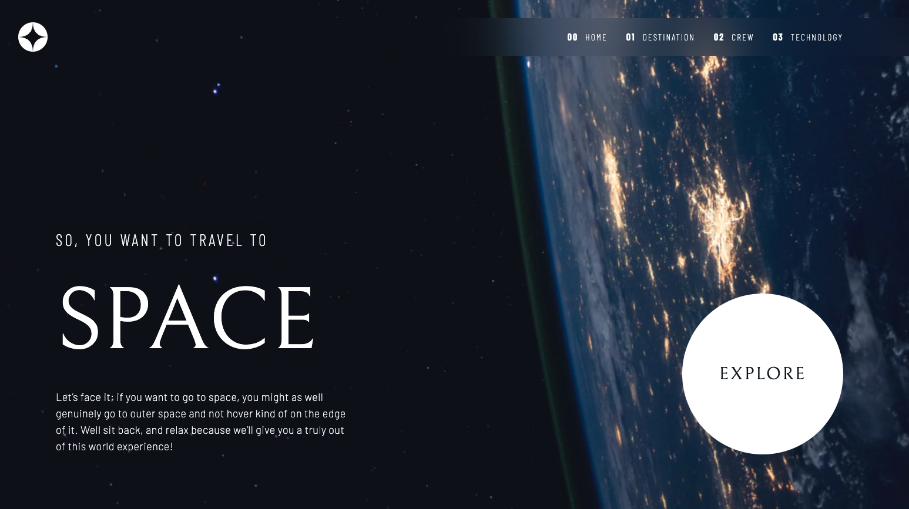

# Frontend Mentor - Space tourism website solution

This is a solution to the [Space tourism website challenge on Frontend Mentor](https://www.frontendmentor.io/challenges/space-tourism-multipage-website-gRWj1URZ3). Frontend Mentor challenges help you improve your coding skills by building realistic projects.

## Table of contents

- [Overview](#overview)
  - [Screenshot](#screenshot)
  - [Links](#links)
- [My process](#my-process)
  - [Built with](#built-with)
- [Author](#author)
- [Getting Started](#getting-started)

## Overview

This project was built in [Next 13](https://beta.nextjs.org/docs/getting-started) (with app directory (beta)), [TailwindCSS](https://tailwindcss.com/) and [TypeScript](https://www.typescriptlang.org/). In this project I used new features which Next.js 13 deliver:

- [next/image](https://beta.nextjs.org/docs/api-reference/components/image),
- [next/link](https://beta.nextjs.org/docs/api-reference/components/link),
- [@next/font (beta)](https://beta.nextjs.org/docs/api-reference/components/font),
- [layout.js](https://beta.nextjs.org/docs/api-reference/file-conventions/layout),
- [page.js](https://beta.nextjs.org/docs/api-reference/file-conventions/page),
- [loading.js](https://beta.nextjs.org/docs/api-reference/file-conventions/loading),
- [head.js](https://beta.nextjs.org/docs/api-reference/file-conventions/head),
- [not-found.js](https://beta.nextjs.org/docs/api-reference/file-conventions/not-found),
- etc.

### Screenshot



### Links

- Solution URL: [on Github](https://github.com/binkowskidawid/space-tourism)
- Live Site URL: [on Vercel](https://space-tourism-binkowskidawid.vercel.app/)

## My process

### Built with

- [TypeScript](https://www.typescriptlang.org/),
- [Next.js 13](https://beta.nextjs.org/docs/getting-started),
- [TailwindCSS](https://tailwindcss.com/),
- Flexbox,
- Mobile-first workflow.

## Author

- Website - [Dawid Bińkowski](https://www.davecoding.xyz)
- Frontend Mentor - [@binkowskidawid](https://www.frontendmentor.io/profile/binkowskidawid)
- Twitter - [@David02838996](https://twitter.com/David02838996)

## Getting Started

First, run the development server:

```bash
npm install
npm run dev
# or
yarn install
yarn dev
```

Open [http://localhost:3000](http://localhost:3000) with your browser to see the result.
